# Delivery Refugio — Detalle del sistema

Documento orientado a **entendimiento operativo y técnico**: actores, casos de uso (CUS), **máquinas de estado** de pedido y de conductor, escenarios concretos, eventos en tiempo real y constantes. La fuente de verdad del comportamiento es el backend (`backend/app/api/delivery.py`, `backend/app/core/delivery_constants.py`, modelos en `backend/app/models/delivery.py`).

---

## 1. Visión general

El módulo conecta **tres mundos**:

| Origen | Rol |
|--------|-----|
| **Fidelio** (POS / integración) | Marca pedidos como listos para recojo (`LISTO`) vía webhook S2S. |
| **Kiosko SUNMI** | Registra **llegadas de conductores** (`DriverArrival`): código de pedido, plataforma, datos opcionales (placa, alias). Puede **matchear** automáticamente con un pedido activo. |
| **Runners** (app móvil + panel) | **Aceptan** pedidos, pasan a **recojo en estante**, **marcan entrega**; el panel admin puede **matcheo manual**, cancelaciones, devoluciones, desbloqueos. |

La **relación pedido ↔ conductor** es 1:1 cuando hay match: el pedido referencia al conductor vía `matched_driver_arrival` y el conductor tiene `matched_order_id` único.

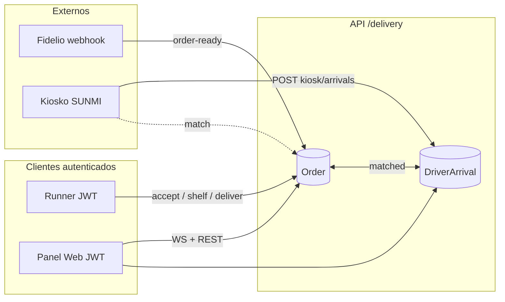

---

## 2. Actores

| Actor | Descripción | Autenticación / canal |
|-------|-------------|------------------------|
| **Sistema Fidelio** | Emite “pedido listo” con restaurante, plataforma, código y opcionalmente bolsas. | Header `X-API-Key` si está definido `FIDELIO_API_KEY` en el servidor. |
| **Kiosko** | Registra conductores; consulta cola y entregas del día (endpoints públicos). | Sin JWT en rutas `/kiosk/*` documentadas. |
| **Runner** | Opera el flujo de recojo y entrega; puede registrar token push Expo. | JWT + validación de permisos (`delivery:view` / `delivery:operate`). |
| **Operador panel** | Misma API vía panel: listados, WebSocket, matcheo manual con `delivery:operate`. | JWT + permisos. |
| **Administrador delivery** | Listados amplios, marcar devolución, cancelar, desbloquear `locked_by_runner`. | JWT + `delivery:admin` (o superuser). |
| **Sistema (timeouts)** | Expira estados por tiempo en `PROCESO_ENTREGA` (pedido) y `ESPERANDO` (conductor). | Llamado desde varios endpoints y `POST /delivery/maintenance/apply-timeouts`. |

**Superusuario**: bypass de permisos en comprobaciones `_require_permission`; en acciones de pedido el código puede permitir excepciones puntuales (p. ej. tomar pedido bloqueado por otro usuario solo en flujos explícitos — revisar reglas por endpoint).

---

## 3. Permisos (resumen)

| Codename | Uso principal |
|----------|----------------|
| `delivery:view` | WebSocket, listados operativos (`/orders/active`, `/drivers/waiting`), detalle de pedido, registro push Runner. |
| `delivery:operate` | Aceptar pedido, shelf, entregar, **matcheo manual**. |
| `delivery:admin` | Listados admin, marcar devolución, cancelar, unlock sin cambiar estado del pedido. |

---

## 4. Casos de uso por actor (CUS)

### 4.1 Fidelio

| ID | Caso de uso | Descripción | Resultado esperado |
|----|-------------|-------------|-------------------|
| F-01 | Notificar pedido listo | `POST /delivery/webhooks/fidelio/order-ready` con `restaurant_fidelio_id`, `plataforma`, `codigo_pedido`. | Restaurante debe existir en BD. Pedido nuevo o actualizado en estado **LISTO**; timestamps `listo_at`, `estado_changed_at`. |
| F-02 | Idempotencia / re-listado | Mismo código + misma plataforma + restaurante; pedido aún no terminal. | Vuelve a **LISTO** y actualiza bolsas si vienen en payload. |
| F-03 | Nuevo ciclo tras terminal | Si el único registro activo estaba ENTREGADO/CANCELADO, se crea **nuevo** `Order`. | Nuevo ID de pedido. |
| F-04 | Early bird | Tras crear/actualizar a LISTO, existe conductor **ESPERANDO** con código fuzzy ≥ umbral. | Match inmediato: pedido **LISTO_PARA_ENTREGAR**, conductor **EN_MATCH**; eventos `PRIORITY_UPDATE`, `ORDER_UPDATED`, `DRIVER_UPDATED`. |

#### Prueba manual del webhook en producción (`curl`)

**URL** (API pública): `https://api.datarefugio.gcbprojects.site/api/delivery/webhooks/fidelio/order-ready`

**Seguridad:** El header `X-API-Key` debe coincidir exactamente con la variable de entorno **`FIDELIO_API_KEY`** configurada en el servidor. **No** pegues claves reales en repos, tickets ni documentación versionada; exporta la clave solo en tu terminal o úsala desde un gestor de secretos.

**Body JSON** (Pydantic): `restaurant_fidelio_id`, `plataforma`, `codigo_pedido` obligatorios; `numero_bolsas` opcional. La API normaliza `plataforma` a mayúsculas.

Abajo, dos llamadas de ejemplo con **códigos de pedido realistas** (formato típico por agregador) y el mismo restaurante que ya usas en integración. Sustituye `$FIDELIO_API_KEY` por el valor del servidor o define `export FIDELIO_API_KEY='…'` antes de ejecutar.


**1) Plataforma RAPPI**

```bash
curl --location 'https://api.datarefugio.gcbprojects.site/api/delivery/webhooks/fidelio/order-ready' \
  --header 'Content-Type: application/json' \
  --header "X-API-Key: ${FIDELIO_API_KEY}" \
  --data '{
    "restaurant_fidelio_id": "A03_BARRIO_MANCORA",
    "plataforma": "RAPPI",
    "codigo_pedido": "RAP-A03-584921",
    "numero_bolsas": 2
  }'
```

**2) Plataforma PEDIDOSYA** (segunda agregadora; el kiosko y los runners filtran por la misma cadena en `plataforma`)

```bash
curl --location 'https://api.datarefugio.gcbprojects.site/api/delivery/webhooks/fidelio/order-ready' \
  --header 'Content-Type: application/json' \
  --header "X-API-Key: ${FIDELIO_API_KEY}" \
  --data '{
    "restaurant_fidelio_id": "A03_BARRIO_MANCORA",
    "plataforma": "PEDIDOSYA",
    "codigo_pedido": "PY-A03-908441",
    "numero_bolsas": 1
  }'
  
```
${FIDELIO_API_KEY} = cedd7f5c334438ba45379f22b00baf9196c848b1d1a2e1847b112db5e448965


**Respuesta esperada:** JSON `OrderOut` (`200`) con el pedido en estado **LISTO** (o **LISTO_PARA_ENTREGAR** si aplica early bird). `404` si `restaurant_fidelio_id` no está dado de alta en `delivery_restaurants`; `401` si la API key no coincide o está definida en servidor y falta/envía mal el header.

### 4.2 Kiosko

| ID | Caso de uso | Descripción | Resultado esperado |
|----|-------------|-------------|-------------------|
| K-01 | Registrar llegada | `POST /delivery/kiosk/arrivals` con plataforma, código ingresado, etc. | Nuevo `DriverArrival` en **ESPERANDO**. |
| K-02 | Colisión de código | Ya hay otro arrival **ESPERANDO** o **EN_MATCH** con mismo `plataforma` + mismo `codigo_ingresado` (tal cual, no solo normalizado). | Los anteriores pasan a **ABANDONO**; luego se crea el nuevo. |
| K-03 | Match exacto | Entre candidatos (`LISTO` o `PROCESO_ENTREGA`, misma plataforma), código normalizado igual al ingresado. | `_apply_order_driver_match`: pedido **LISTO_PARA_ENTREGAR**, conductor **EN_MATCH**; si había otro conductor enlazado al pedido, ese pasa a **ABANDONO**. |
| K-04 | Match fuzzy | Sin exacto; mejor candidato con `fuzz.ratio` ≥ `FUZZY_MATCH_THRESHOLD` (85). | Igual que K-03; se devuelve `match_score`. |
| K-05 | Sin match | Ningún candidato supera umbral. | Respuesta `matched: false`; WebSocket `NUEVO_DRIVER_ESPERANDO`; **push** en background a tokens Runner activos (`notify_runners_new_driver_waiting_sync`). |
| K-06 | Consultar cola | `GET /delivery/kiosk/drivers/waiting`. | Conductores **ESPERANDO** y **EN_MATCH** (tras `apply_timeouts`). |
| K-07 | Entregas del día | `GET /delivery/kiosk/orders/delivered/today`. | Pedidos **ENTREGADO** con timestamp entrega en día Lima actual. |

### 4.3 Runner / operador (REST)

| ID | Caso de uso | Endpoint | Precondiciones | Efecto |
|----|-------------|----------|----------------|--------|
| R-01 | Aceptar pedido | `POST .../orders/{id}/accept` | No ENTREGADO/CANCELADO/DEVOLUCION; no bloqueado por otro runner. | `locked_by_runner_id` = usuario; estado **PENDIENTE_RECOJO**. En la práctica debe usarse cuando el pedido ya tiene sentido operativo (típicamente **LISTO_PARA_ENTREGAR**), porque **deliver** exige conductor matcheado. |
| R-02 | Marcar recogido (estante) | `POST .../orders/{id}/shelf` | No ENTREGADO/CANCELADO/DEVOLUCION; lock del runner o superuser. | **PROCESO_ENTREGA**; `recogido_at`. |
| R-03 | Marcar entregado | `POST .../orders/{id}/deliver` | Hay **matched_driver_arrival**; no CANCELADO/DEVOLUCION. | Pedido **ENTREGADO**; conductor vinculado **DESPACHADO** (`despachado_at`). |
| R-04 | Matcheo manual | `POST .../orders/{id}/manual-match` | `delivery:operate`; pedido no ENTREGADO/CANCELADO; arrival no ABANDONO. | Enlace pedido–conductor; liberaciones: conductor previo del pedido → **ABANDONO**; si el arrival estaba en otro pedido, ese pedido vuelve a **LISTO**. |
| R-05 | Listar activos / esperando | `GET /orders/active`, `GET /drivers/waiting` | `delivery:view` | Incluye aplicación de timeouts al entrar. |

### 4.4 Administrador

| ID | Caso de uso | Endpoint | Efecto |
|----|-------------|----------|--------|
| A-01 | Listar todos / por estado | `GET /admin/orders`, `GET /admin/orders/by-status/{status}` | Hasta `DEFAULT_QUERY_LIMIT` (500). |
| A-02 | Marcar devolución | `POST /admin/orders/{id}/mark-devolucion` | No si ya CANCELADO o ENTREGADO. Estado **DEVOLUCION**; `devolucion_at`. |
| A-03 | Cancelar | `POST /admin/orders/{id}/cancel` | No ENTREGADO. **CANCELADO**; limpia `locked_by_runner_id`. |
| A-04 | Desbloquear | `POST /admin/orders/{id}/unlock` | Solo quita lock; **no** cambia `estado`. |

### 4.5 Sistema (mantenimiento / tiempo)

| ID | Caso de uso | Descripción |
|----|-------------|-------------|
| T-01 | Aplicar timeouts | `apply_timeouts`: pedidos en **PROCESO_ENTREGA** con antigüedad de estado > `ORDER_TIMEOUT_MINUTES` (30) → **DEVOLUCION**; conductores **ESPERANDO** > `DRIVER_TIMEOUT_MINUTES` (30) → **ABANDONO**. |
| T-02 | Disparador | Se ejecuta al inicio de muchas rutas y vía `POST /delivery/maintenance/apply-timeouts`. Si hay cambios, emite `TIMEOUTS_APPLIED` por WebSocket. |

**Nota:** El tiempo se calcula respecto a `estado_changed_at` si existe, si no `updated_at` o `created_at` (`_get_state_ts`).

---

## 5. Máquina de estados — Pedido (`Order.estado`)

Estados definidos en constantes: `LISTO`, `PENDIENTE_RECOJO`, `PROCESO_ENTREGA`, `LISTO_PARA_ENTREGAR`, `ENTREGADO`, `DEVOLUCION`, `CANCELADO`.

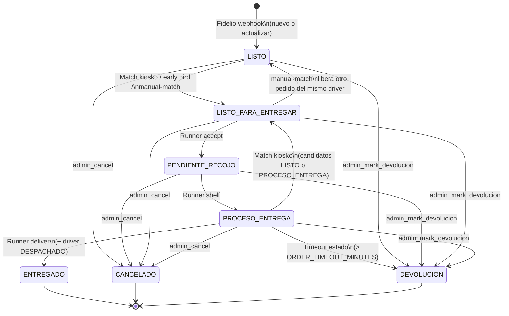

### Transiciones no triviales (profundización)

- **LISTO → LISTO_PARA_ENTREGAR** siempre implica **enlace** con un `DriverArrival` (kiosko, early bird desde Fidelio, o manual). El pedido puede seguir en **LISTO** o **PROCESO_ENTREGA** como candidato de kiosko; al matchear desde kiosko se llama `_apply_order_driver_match`, que fuerza **LISTO_PARA_ENTREGAR** (incluso si antes estaba en `PROCESO_ENTREGA` — el candidato incluye ambos estados).
- **Bloqueo lógico**: `locked_by_runner_id` no es un estado, pero condiciona **accept** (409 si otro runner lo tomó) y **shelf**/**deliver** (403 si no es el dueño, salvo superuser donde aplique el código).
- **Entrega**: exige `matched_driver_arrival` en BD; no basta con el estado del pedido.

---

## 6. Máquina de estados — Conductor (`DriverArrival.estado`)

Estados: `ESPERANDO`, `EN_MATCH`, `DESPACHADO`, `ABANDONO`.

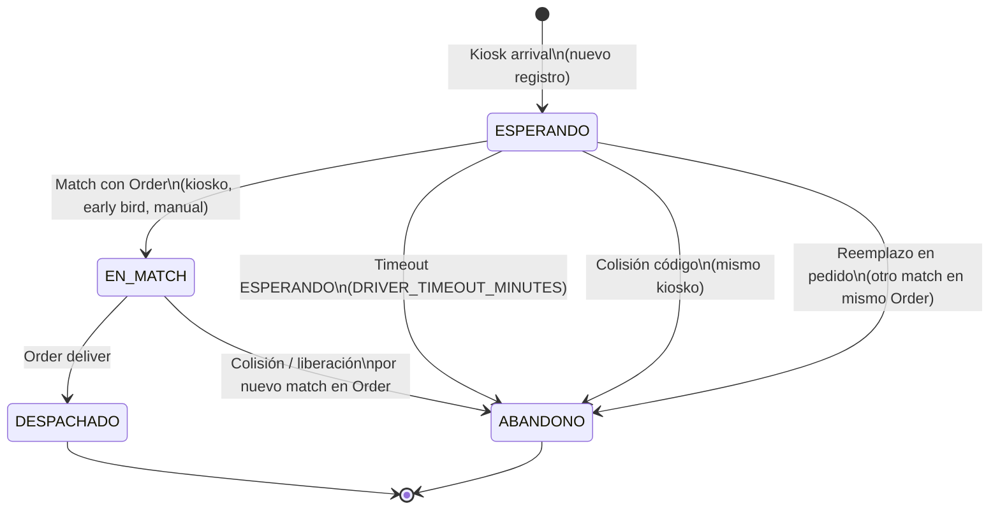

- **EN_MATCH** no pasa a **DESPACHADO** hasta que el **pedido** se marca **ENTREGADO** desde la app runner.
- **ABANDONO** agrupa abandono operativo (timeout) y “desplazado” por otro conductor o colisión de código en kiosko.

---

## 7. Escenarios en producción (guía paso a paso + Mermaid)

**Base de la API (producción):** `https://api.datarefugio.gcbprojects.site/api`

**Variables útiles** (defínelas en tu terminal antes de copiar los comandos):

| Variable | Significado |
|----------|-------------|
| `FIDELIO_API_KEY` | Misma clave que `FIDELIO_API_KEY` en el servidor (webhook Fidelio). |
| `ACCESS_TOKEN` | JWT de un usuario con `delivery:operate` (y `delivery:view` para listados). |
| `ADMIN_TOKEN` | JWT de un usuario con `delivery:admin`. |
| `ORDER_ID` / `DRIVER_ARRIVAL_ID` | Enteros que devuelve la API en JSON (`id`) o que ves en el panel. |

Los ejemplos usan restaurante **`A03_BARRIO_MANCORA`** y códigos de pedido ficticios pero **realistas** por plataforma. El kiosko exige **`placa`** y **`alias_conductor`** no vacíos (`KioskArrivalIn`).

**Privacidad:** no commitees tokens ni claves; aquí solo placeholders.

**Antes de ejecutar los escenarios:** conviene fijar la base una sola vez:

```bash
export PROD_API='https://api.datarefugio.gcbprojects.site/api'
```

---

### Escenario 1 — Flujo feliz (pedido primero → kiosko → runner)

Flujo completo hasta entrega, con el pedido creado por webhook antes de que el conductor llegue al kiosko.

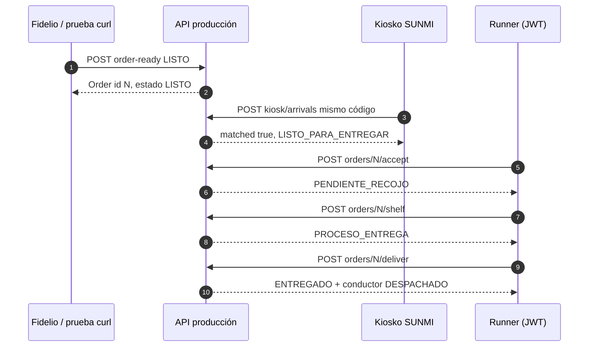

**Pasos**

1. **Pedido listo (simula Fidelio en producción)**  
   Sustituye el código por uno que no choque con pruebas anteriores si quieres un pedido limpio.

   ```bash
   curl --location "${PROD_API}/delivery/webhooks/fidelio/order-ready" \
     --header 'Content-Type: application/json' \
     --header "X-API-Key: ${FIDELIO_API_KEY}" \
     --data '{
       "restaurant_fidelio_id": "A03_BARRIO_MANCORA",
       "plataforma": "RAPPI",
       "codigo_pedido": "RAP-A03-77001",
       "numero_bolsas": 2
     }'
   ```
   Anota el **`id`** del pedido en la respuesta → será `ORDER_ID`.

2. **Llegada del conductor al kiosko** (misma `plataforma` y mismo código que en el paso 1).

   ```bash
   curl --location "${PROD_API}/delivery/kiosk/arrivals" \
     --header 'Content-Type: application/json' \
     --data '{
       "plataforma": "RAPPI",
       "codigo_ingresado": "RAP-A03-77001",
       "placa": "ABC1D23",
       "alias_conductor": "Luis Prueba"
     }'
   ```
   Verifica `"matched": true` y `matched_order.estado` = **LISTO_PARA_ENTREGAR**.

3. **Runner acepta el pedido**

   ```bash
   curl --location -X POST "${PROD_API}/delivery/orders/${ORDER_ID}/accept" \
     --header "Authorization: Bearer ${ACCESS_TOKEN}"
   ```

4. **Runner marca recojo en estante**

   ```bash
   curl --location -X POST "${PROD_API}/delivery/orders/${ORDER_ID}/shelf" \
     --header "Authorization: Bearer ${ACCESS_TOKEN}"
   ```

5. **Runner marca entrega** (solo si hay `matched_driver_arrival` en el pedido).

   ```bash
   curl --location -X POST "${PROD_API}/delivery/orders/${ORDER_ID}/deliver" \
     --header "Authorization: Bearer ${ACCESS_TOKEN}"
   ```

6. **Comprobación opcional** (JWT con `delivery:view`):  
   `GET ${PROD_API}/delivery/orders/active` — el pedido ya no debe aparecer como activo; en kiosko del día:  
   `GET ${PROD_API}/delivery/kiosk/orders/delivered/today`.

---

### Escenario 2 — Early bird (conductor primero, luego Fidelio)

El conductor queda **ESPERANDO**; al llegar el webhook con código compatible, el backend enlaza en caliente (fuzzy ≥ 85 si aplica).

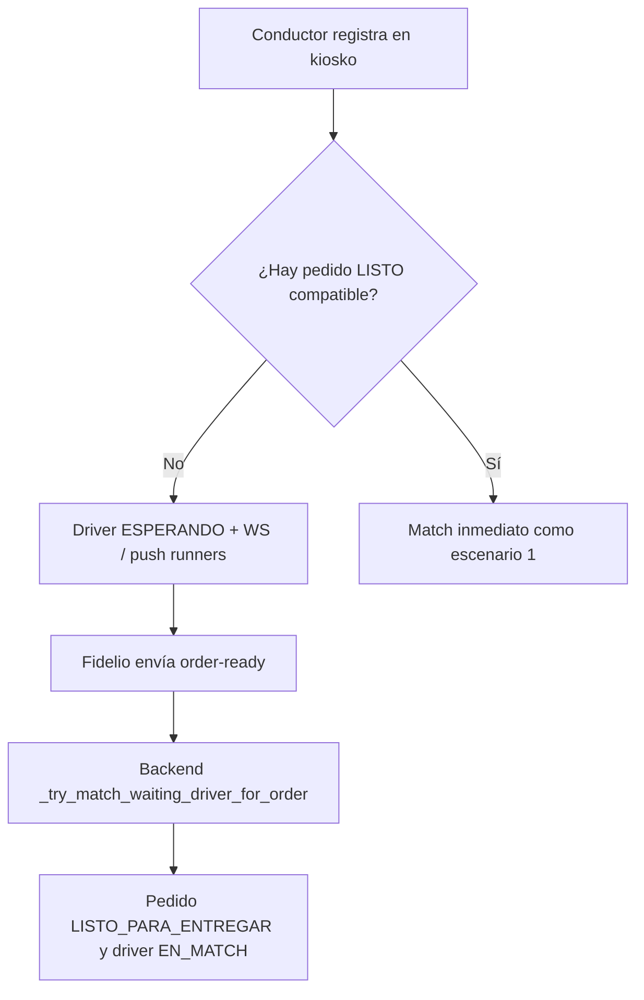

**Pasos**

1. **Kiosko primero** con un código que aún **no** tenga pedido `LISTO` en BD (ej. código nuevo).

   ```bash
   curl --location "${PROD_API}/delivery/kiosk/arrivals" \
     --header 'Content-Type: application/json' \
     --data '{
       "plataforma": "PEDIDOSYA",
       "codigo_ingresado": "PY-A03-77002",
       "placa": "XYZ9K87",
       "alias_conductor": "María Early"
     }'
   ```
   Respuesta esperada: `"matched": false`, `driver_arrival.estado` = **ESPERANDO**.

2. **Webhook Fidelio** con el **mismo** código (y misma plataforma).

   ```bash
   curl --location "${PROD_API}/delivery/webhooks/fidelio/order-ready" \
     --header 'Content-Type: application/json' \
     --header "X-API-Key: ${FIDELIO_API_KEY}" \
     --data '{
       "restaurant_fidelio_id": "A03_BARRIO_MANCORA",
       "plataforma": "PEDIDOSYA",
       "codigo_pedido": "PY-A03-77002",
       "numero_bolsas": 1
     }'
   ```
   Respuesta: pedido en **LISTO_PARA_ENTREGAR** y conductor pasado a **EN_MATCH**; en clientes WebSocket verás eventos `early_bird` / `ORDER_UPDATED`.

3. Continúa con **accept → shelf → deliver** como en el escenario 1 usando el `ORDER_ID` devuelto.

---

### Escenario 3 — Colisión: dos conductores, mismo texto de código en kiosko

Si un segundo conductor ingresa exactamente la misma `plataforma` y el mismo `codigo_ingresado` (mismo string), los registros previos en **ESPERANDO** o **EN_MATCH** pasan a **ABANDONO**.

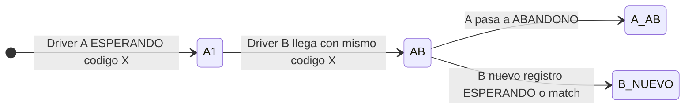

**Pasos**

1. Crea un pedido y un primer match (puedes usar el flujo del escenario 1 con código `RAP-A03-77003`) **o** deja solo un conductor en **ESPERANDO** sin pedido.

2. **Primer kiosko** (ejemplo sin pedido previo, solo cola):

   ```bash
   curl --location "${PROD_API}/delivery/kiosk/arrivals" \
     --header 'Content-Type: application/json' \
     --data '{
       "plataforma": "RAPPI",
       "codigo_ingresado": "RAP-A03-COLISION",
       "placa": "COL111",
       "alias_conductor": "Conductor A"
     }'
   ```

3. **Segundo kiosko** con el mismo `plataforma` y **exactamente** el mismo `codigo_ingresado`:

   ```bash
   curl --location "${PROD_API}/delivery/kiosk/arrivals" \
     --header 'Content-Type: application/json' \
     --data '{
       "plataforma": "RAPPI",
       "codigo_ingresado": "RAP-A03-COLISION",
       "placa": "COL222",
       "alias_conductor": "Conductor B"
     }'
   ```
4. **Verificación:** con JWT, `GET ${PROD_API}/delivery/drivers/waiting`: el arrival del conductor A debe estar **ABANDONO**; el B es el vigente en **ESPERANDO** (salvo que haya matcheado con un pedido).

---

### Escenario 4 — Match manual (kiosko no alcanza el umbral fuzzy 85)

El kiosko no enlaza; el operador fuerza el enlace con IDs.

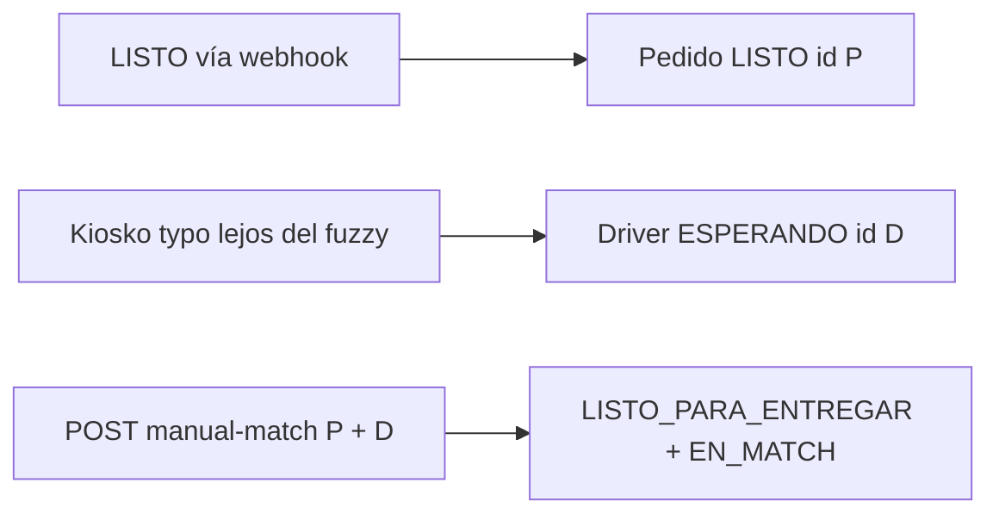

**Pasos**

1. Crea un pedido **LISTO** con código “oficial”, por ejemplo `RAP-A03-77004`.

2. En kiosko ingresa un código **muy distinto** (ej. `RAP-A03-XXXX` sin parecido ≥ 85) para generar **ESPERANDO** sin match:

   ```bash
   curl --location "${PROD_API}/delivery/kiosk/arrivals" \
     --header 'Content-Type: application/json' \
     --data '{
       "plataforma": "RAPPI",
       "codigo_ingresado": "RAP-ZZZ-99999",
       "placa": "MAN01",
       "alias_conductor": "Operador manual"
     }'
   ```
   Anota `driver_arrival.id` → `DRIVER_ARRIVAL_ID`.

3. Lista pedidos activos y confirma `ORDER_ID` del paso 1:

   ```bash
   curl --location "${PROD_API}/delivery/orders/active" \
     --header "Authorization: Bearer ${ACCESS_TOKEN}"
   ```

4. **Match manual** (permiso `delivery:operate`):

   ```bash
   curl --location -X POST "${PROD_API}/delivery/orders/${ORDER_ID}/manual-match" \
     --header 'Content-Type: application/json' \
     --header "Authorization: Bearer ${ACCESS_TOKEN}" \
     --data "{\"driver_arrival_id\": ${DRIVER_ARRIVAL_ID}}"
   ```

---

### Escenario 5 — Timeout operativo pedido en reparto (**PROCESO_ENTREGA** → **DEVOLUCION**)

Tras **30 minutos** sin cambio de estado relevante (`ORDER_TIMEOUT_MINUTES`), la siguiente ejecución de `apply_timeouts` marca **DEVOLUCION**.

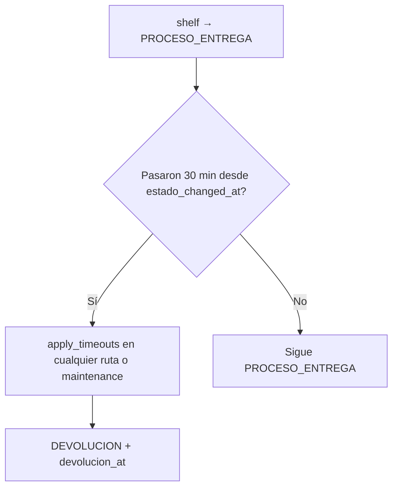

**Pasos**

1. Lleva un pedido hasta **PROCESO_ENTREGA** (webhook + kiosko + **accept** + **shelf**) como en el escenario 1.

2. **Espera 30 minutos** en entorno real **o** en laboratorio ajusta temporalmente la constante `ORDER_TIMEOUT_MINUTES` (solo entornos no productivos).

3. Dispara la limpieza (en producción esto también ocurre al entrar a muchos endpoints; existe además el mantenimiento):

   ```bash
   curl --location -X POST "${PROD_API}/delivery/maintenance/apply-timeouts"
   ```

4. Vuelve a consultar el pedido (`GET .../delivery/orders/{ORDER_ID}` con JWT): debe figurar **DEVOLUCION**.

---

### Escenario 6 — Timeout conductor en sala (**ESPERANDO** → **ABANDONO**)

Misma idea con **`DRIVER_TIMEOUT_MINUTES`** (30 min) para conductores esperando sin match exitoso reciente.

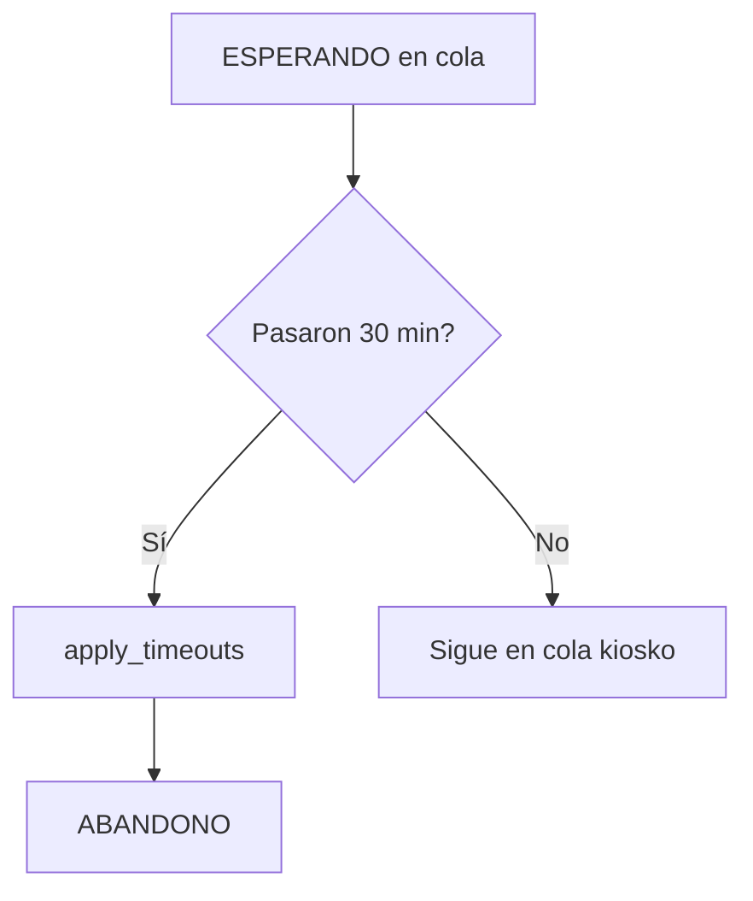

**Pasos**

1. Registra un conductor en kiosko **sin** pedido compatible (`matched: false`).

2. Tras el umbral temporal, ejecuta:

   ```bash
   curl --location -X POST "${PROD_API}/delivery/maintenance/apply-timeouts"
   ```

3. `GET ${PROD_API}/delivery/kiosk/drivers/waiting`: ese conductor ya no debe aparecer como **ESPERANDO**; en admin/BD su estado es **ABANDONO**.

---

### Escenario 7 — Cancelación administrativa

Cierra el ciclo sin entrega; libera lock del runner.

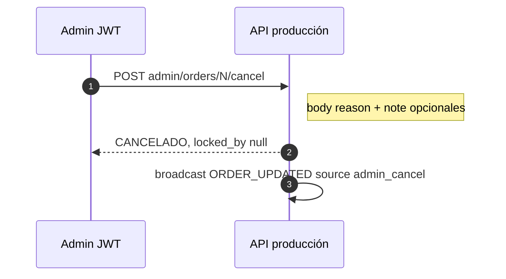

**Pasos**

1. Ten un pedido activo (por ejemplo en **LISTO** o **PENDIENTE_RECOJO**). Anota `ORDER_ID`.

2. **Cancelar** (`delivery:admin`):

   ```bash
   curl --location -X POST "${PROD_API}/delivery/admin/orders/${ORDER_ID}/cancel" \
     --header 'Content-Type: application/json' \
     --header "Authorization: Bearer ${ADMIN_TOKEN}" \
     --data '{
       "reason": "prueba_documentacion",
       "note": "Cancelado desde guía .DOC_DETALLE_DELIVERY"
     }'
   ```

3. Verifica `estado` = **CANCELADO** y `locked_by_runner_id` = `null`. No aplica a pedidos ya **ENTREGADO**.

**Nota sobre `maintenance/apply-timeouts`:** hoy el endpoint no exige JWT; si lo expones a internet, valora protegerlo (red interna, API key o rol admin) para evitar abuso.

---

## 8. Tiempo real — WebSocket

- **URL:** `GET /delivery/ws?token=<JWT>`.
- **Requisitos:** usuario activo con `delivery:view` o superuser.
- **Eventos emitidos por el servidor** (campo `type`): `ORDER_UPDATED`, `DRIVER_UPDATED`, `PRIORITY_UPDATE`, `TIMEOUTS_APPLIED`. Cada mensaje incluye `ts` ISO y `payload` según el evento.

Útil para panel y cualquier cliente que mantenga la vista sincronizada sin polling agresivo.

---

## 9. Push (Runner — Expo)

- Cuando un conductor queda **ESPERANDO** sin match automático, se programa notificación a todos los tokens **activos** en `delivery_runner_push_tokens`.
- Registro: `POST /delivery/push/register` (`delivery:view`, `app_slug` = `runner`).
- Payload de datos incluye `type: NUEVO_DRIVER_ESPERANDO`, ids y código para deep-link o filtrado en la app.

---

## 10. Constantes operativas (referencia)

| Constante | Valor | Rol |
|-----------|-------|-----|
| `FUZZY_MATCH_THRESHOLD` | 85 | Mínimo `fuzz.ratio` para match automático (kiosko y early bird). |
| `ORDER_TIMEOUT_MINUTES` | 30 | Máximo en **PROCESO_ENTREGA** antes de **DEVOLUCION** automática. |
| `DRIVER_TIMEOUT_MINUTES` | 30 | Máximo en **ESPERANDO** antes de **ABANDONO**. |
| `MATCH_CANDIDATES_LIMIT` | 200 | Ventana de candidatos al comparar códigos. |
| `DEFAULT_QUERY_LIMIT` | 500 | Tope de listados. |

Mantener alineación con `frontend` y `mobile/packages/constants` donde existan espejos de estos valores.

---

## 11. Entidades persistentes (resumen)

| Tabla / modelo | Campos de negocio relevantes |
|----------------|------------------------------|
| `Restaurant` | `fidelio_id` enlaza webhook Fidelio. |
| `Order` | `estado`, `plataforma`, `codigo_pedido`, `numero_bolsas`, `locked_by_runner_id`, timestamps de ciclo (`listo_at`, `match_at`, `recogido_at`, `entregado_at`, ...). |
| `DriverArrival` | `estado`, `codigo_ingresado`, `matched_order_id` único. |
| `DeliveryRunnerPushToken` | `expo_push_token` único, `user_id`, `is_active`. |

---

## 12. Diagrama de secuencia — Match desde kiosko

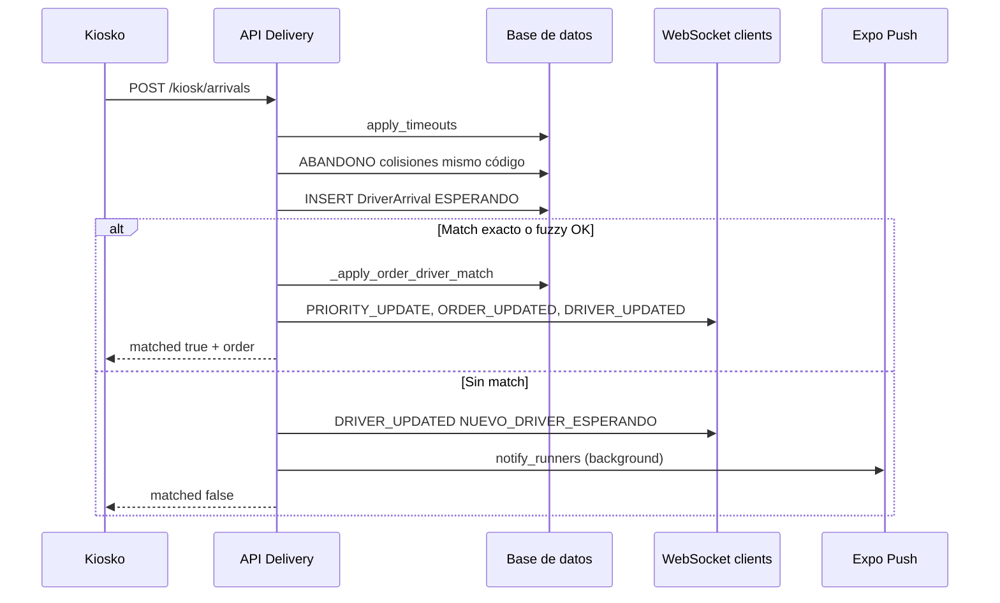

Este documento puede usarse como **mapa mental** para onboarding y para contrastar futuros cambios de reglas de negocio contra el código actual.


