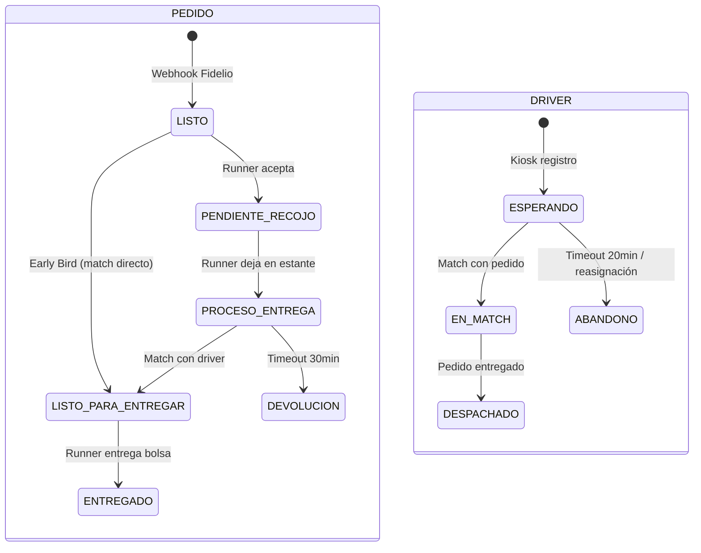
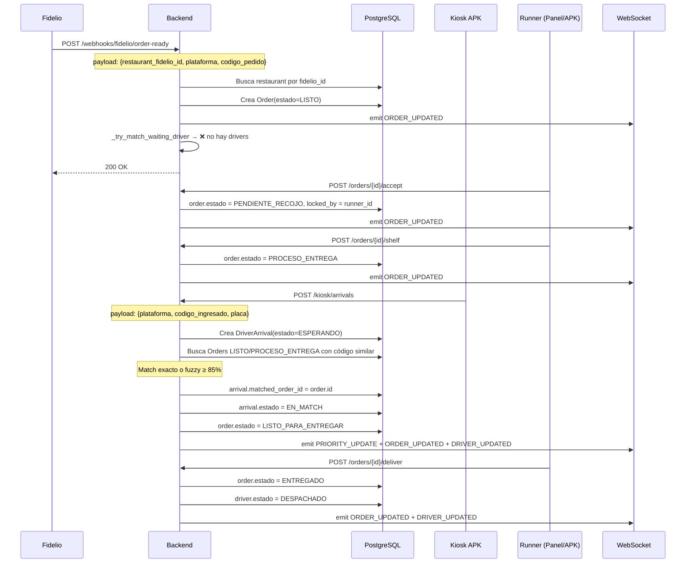
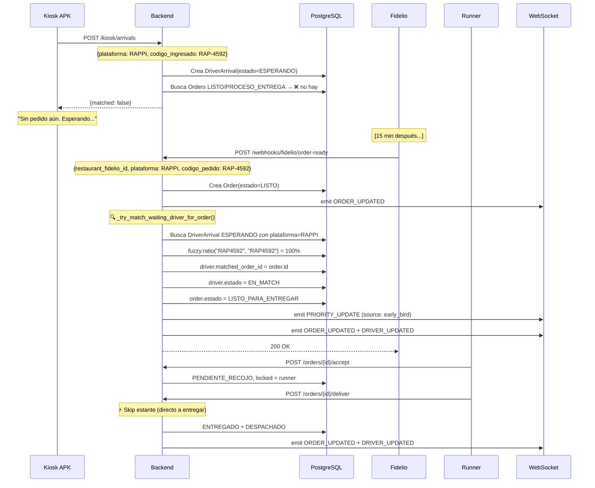
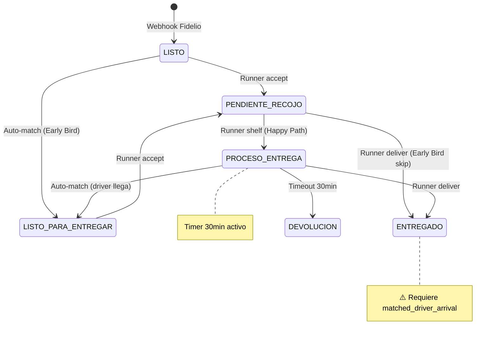

# 🔍 Revisión de Flujos: Order ↔ Driver — Planificación vs Código

> Fecha: 2026-03-19 · Fuentes: [PLANNING_DELIVERY.md](file:///c:/Users/gcbso/Downloads/DATA%20Y%20AUTOMATIZACI%C3%93N/Scripts/Proyecto%20-%20carga%20de%20Datos%20a%20Big%20Query%20v2/001_procesamiento_refugio/.docs/PLANNING_DELIVERY.md) (specs) + [api/delivery.py](file:///c:/Users/gcbso/Downloads/DATA%20Y%20AUTOMATIZACI%C3%93N/Scripts/Proyecto%20-%20carga%20de%20Datos%20a%20Big%20Query%20v2/001_procesamiento_refugio/backend/app/api/delivery.py) (código)

---

## 📐 Máquina de estados según PLANNING_DELIVERY.md



---

## 🟢 Caso A: Pedido llega PRIMERO, driver llega DESPUÉS (Happy Path)

### Secuencia según specs (Escenario 1)

```
1. Fidelio → Webhook → Order.estado = LISTO
2. Runner ve pedido → Acepta → PENDIENTE_RECOJO (locked)
3. Runner busca bolsa → La deja en estante → PROCESO_ENTREGA (timer 30min)
4. Driver llega a kiosk → Se registra → DriverArrival.estado = ESPERANDO
5. Sistema cruza datos → Match → Order = LISTO_PARA_ENTREGAR, Driver = EN_MATCH
6. Runner entrega bolsa → Order = ENTREGADO, Driver = DESPACHADO
```

### ¿Qué hace el código? ✅ Correcto (con matices)



### Hallazgos vs planificación

| Paso | Spec | Código | ¿OK? |
|------|------|--------|:----:|
| 1. Webhook crea LISTO | ✅ | ✅ línea 327 | ✅ |
| 2. Runner acepta → PENDIENTE_RECOJO | ✅ | ✅ línea 689 | ✅ |
| 3. Runner shelf → PROCESO_ENTREGA | ✅ | ✅ línea 723 | ⚠️ **No verifica match** |
| 4. Kiosk arrival → ESPERANDO | ✅ | ✅ línea 425 | ✅ |
| 5. Match exacto/fuzzy | ✅ umbral 90% | ✅ umbral 85% | ⚠️ Umbral distinto |
| 6. Deliver → ENTREGADO + DESPACHADO | ✅ | ✅ línea 758-763 | ⚠️ **No verifica match** |

> [!WARNING]
> **Bug Punto 7 confirmado**: Los endpoints [shelf](file:///c:/Users/gcbso/Downloads/DATA%20Y%20AUTOMATIZACI%C3%93N/Scripts/Proyecto%20-%20carga%20de%20Datos%20a%20Big%20Query%20v2/001_procesamiento_refugio/backend/app/api/delivery.py#700-732) y [deliver](file:///c:/Users/gcbso/Downloads/DATA%20Y%20AUTOMATIZACI%C3%93N/Scripts/Proyecto%20-%20carga%20de%20Datos%20a%20Big%20Query%20v2/001_procesamiento_refugio/backend/app/api/delivery.py#221-261) no validan que exista un `matched_driver_arrival`. Según la spec, la entrega solo puede pasar si hay un driver EN_MATCH asociado.

> [!NOTE]
> **Umbral fuzzy**: La spec dice 90%, el código usa 85% (`FUZZY_MATCH_THRESHOLD = 85`). Esto es intencional (más tolerante). Consistente con delivery_constants.py.

---

## 🟡 Caso B: Driver llega PRIMERO, pedido llega DESPUÉS (Early Bird)

### Secuencia según specs (Escenario 2)

```
1. Driver llega a kiosk → Se registra → DriverArrival.estado = ESPERANDO (timer 20min)
2. FastAPI busca pedidos activos → No existe → Sin match
3. UI Runner: alerta naranja "Driver esperando pedido no listo"
4. [Pasan hasta 20 min...]
5. Fidelio envía webhook → Order.estado = LISTO
6. FastAPI detecta driver ESPERANDO con código similar → Match automático
7. Pedido pasa DIRECTO de LISTO a LISTO_PARA_ENTREGAR (skip estante)
8. Runner corre a buscarlo → Entrega directa → ENTREGADO + DESPACHADO
```

### ¿Qué hace el código? ✅ Correcto



### Hallazgos vs planificación

| Paso | Spec | Código | ¿OK? |
|------|------|--------|:----:|
| 1. Kiosk → ESPERANDO si no hay pedido | ✅ | ✅ línea 465 retorna `matched: false` | ✅ |
| 2. Timer 20 min → ABANDONO | ✅ spec 20min | ✅ código 30min (`DRIVER_TIMEOUT_MINUTES=30`) | ⚠️ |
| 3. Webhook → LISTO + auto-match Early Bird | ✅ | ✅ línea 339 [_try_match_waiting_driver_for_order](file:///c:/Users/gcbso/Downloads/DATA%20Y%20AUTOMATIZACI%C3%93N/Scripts/Proyecto%20-%20carga%20de%20Datos%20a%20Big%20Query%20v2/001_procesamiento_refugio/backend/app/api/delivery.py#109-160) | ✅ |
| 4. Match → LISTO_PARA_ENTREGAR directo | ✅ Skip estante | ✅ línea 153 | ✅ |
| 5. Runner toma y entrega directo | ✅ | ✅ Puede accept→deliver sin shelf | ✅ |

> [!NOTE]
> **Timer driver**: La spec dice 20 min, el código usa 30 min (`DRIVER_TIMEOUT_MINUTES = 30`).
> Esto fue un ajuste operativo. La spec original puede actualizarse.

---

## 🔴 Gaps identificados: Código vs Planificación

### Gap 1: Entrega sin driver (Punto 7)

```python
# ACTUAL (delivery.py líneas 734-776)
@router.post("/orders/{order_id}/deliver")
async def runner_deliver_order(...):
    # ❌ NO VERIFICA que order.matched_driver_arrival exista
    order.estado = ORDER_STATUS_ENTREGADO  # Se entrega sin driver!
```

**Spec dice** (Escenario 1, paso 6): *"Runner ve alerta roja [de match], entrega la bolsa"* → Implica que el match es pre-requisito.

### Gap 2: Shelf sin driver matcheado

```python
# ACTUAL (delivery.py líneas 700-731)
@router.post("/orders/{order_id}/shelf")
async def runner_shelf_order(...):
    # ❌ NO VERIFICA match ni estado origen
    order.estado = ORDER_STATUS_PROCESO_ENTREGA  # Pasa a estante sin validación
```

**¿Es esto realmente un bug?** Depende de la interpretación:
- En el **Happy Path**, el shelf sucede ANTES del match. El pedido va al estante y DESPUÉS llega el driver.
- Entonces **shelf NO debería requerir match** — es correcto.
- Lo que SÍ requiere match es la **entrega**.

### Gap 3: Accept no verifica estado origen

```python
# ACTUAL: accept acepta cualquier estado que no sea ENTREGADO/CANCELADO/DEVOLUCION
# Spec: solo se debería aceptar desde LISTO o LISTO_PARA_ENTREGAR
```

### Gap 4: Deliver no verifica que venga de PROCESO_ENTREGA

```python
# ACTUAL: deliver acepta casi cualquier estado
# En el Early Bird: el runner puede ir directo de PENDIENTE_RECOJO → ENTREGADO (skip shelf)
# Spec dice (Early Bird): "saltándose el estante" → ¿permite skip?
```

---

## ✅ Flujo correcto según specs + ajustes

Después de analizar los 6 escenarios de la spec, las reglas correctas son:

### Transiciones de estado permitidas (Pedido)



### Reglas de guards propuestas

| Endpoint | Guard match | Guard estado origen | Notas |
|----------|:---:|:---:|-------|
| [accept](file:///c:/Users/gcbso/Downloads/DATA%20Y%20AUTOMATIZACI%C3%93N/Scripts/Proyecto%20-%20carga%20de%20Datos%20a%20Big%20Query%20v2/001_procesamiento_refugio/backend/app/api/delivery.py#664-698) | ❌ No requiere | LISTO ∨ LISTO_PARA_ENTREGAR | Runner puede tomar un pedido sin driver aún |
| [shelf](file:///c:/Users/gcbso/Downloads/DATA%20Y%20AUTOMATIZACI%C3%93N/Scripts/Proyecto%20-%20carga%20de%20Datos%20a%20Big%20Query%20v2/001_procesamiento_refugio/backend/app/api/delivery.py#700-732) | ❌ No requiere | PENDIENTE_RECOJO | Estante es pre-match en Happy Path |
| [deliver](file:///c:/Users/gcbso/Downloads/DATA%20Y%20AUTOMATIZACI%C3%93N/Scripts/Proyecto%20-%20carga%20de%20Datos%20a%20Big%20Query%20v2/001_procesamiento_refugio/backend/app/api/delivery.py#221-261) | ✅ **Sí requiere match** | PROCESO_ENTREGA ∨ PENDIENTE_RECOJO | Única acción que cierra el ciclo. DEBE tener driver. |
| `manual-match` | N/A | LISTO ∨ PROCESO_ENTREGA | Fallback admin |

> [!IMPORTANT]
> **Conclusión clave**: Solo [deliver](file:///c:/Users/gcbso/Downloads/DATA%20Y%20AUTOMATIZACI%C3%93N/Scripts/Proyecto%20-%20carga%20de%20Datos%20a%20Big%20Query%20v2/001_procesamiento_refugio/backend/app/api/delivery.py#221-261) necesita el guard de match obligatorio.
> [shelf](file:///c:/Users/gcbso/Downloads/DATA%20Y%20AUTOMATIZACI%C3%93N/Scripts/Proyecto%20-%20carga%20de%20Datos%20a%20Big%20Query%20v2/001_procesamiento_refugio/backend/app/api/delivery.py#700-732) no lo necesita porque en el Happy Path el pedido va al estante ANTES de que llegue el driver.
> Esto es diferente de lo que planteamos en el plan anterior — la revisión del flujo lo aclara.

### Diff corregido para [deliver](file:///c:/Users/gcbso/Downloads/DATA%20Y%20AUTOMATIZACI%C3%93N/Scripts/Proyecto%20-%20carga%20de%20Datos%20a%20Big%20Query%20v2/001_procesamiento_refugio/backend/app/api/delivery.py#221-261)

```diff
 @router.post("/orders/{order_id}/deliver", response_model=OrderOut)
 async def runner_deliver_order(...):
     ...
     if order.estado in [ORDER_STATUS_CANCELADO, ORDER_STATUS_DEVOLUCION]:
         raise HTTPException(status_code=400, detail="Pedido no es entregable por estado")
+
+    # REGLA DE NEGOCIO: No se puede entregar sin driver matcheado
+    if not order.matched_driver_arrival:
+        raise HTTPException(
+            status_code=400,
+            detail="No se puede entregar: no hay driver matcheado para este pedido"
+        )
 
     now = _utcnow()
```

### ¿Y el botón "Entregar" en el frontend?

Para [DeliveryPanel.tsx](file:///c:/Users/gcbso/Downloads/DATA%20Y%20AUTOMATIZACI%C3%93N/Scripts/Proyecto%20-%20carga%20de%20Datos%20a%20Big%20Query%20v2/001_procesamiento_refugio/frontend/src/pages/delivery/DeliveryPanel.tsx), el botón "Entregar" debe:
- Estar **visible** siempre (el runner necesita intentar la acción)
- Si no hay match → la **API retorna 400** → el frontend muestra el error SweetAlert
- **Opcionalmente**: deshabilitar visualmente si `matched_driver_arrival_id` es null (mejor UX)

---

## 📊 Resumen de diferencias Spec vs Código

| Aspecto | PLANNING_DELIVERY.md | Código actual | Acción |
|---------|---------------------|---------------|--------|
| Umbral fuzzy | 90% | 85% | Dejar 85% (más tolerante) |
| Timer driver | 20 min | 30 min | Actualizar spec o código |
| Early Bird match | ✅ Detallado | ✅ Implementado | ✅ OK |
| Happy Path match | ✅ Detallado | ✅ Implementado | ✅ OK |
| Doble driver | ✅ Escenario 5 | ✅ línea 405 | ✅ OK |
| Timeout pedido | ✅ 30 min | ✅ 30 min | ✅ OK |
| Guard deliver-sin-match | ✅ Implícito en spec | ❌ Falta | **Implementar** |
| Guard shelf-sin-match | No mencionado | No existe | **No necesario** |
| Guard accept-origen | LISTO/LISTO_PARA_ENTREGAR | Acepta cualquiera no-terminal | ⚠️ Considerar |
| `restaurant_nombre` en webhook | No mencionado | Existe pero innecesario | **Eliminar (punto 5)** |
| Unlock por admin | No mencionado | ✅ Implementado como Escenario 7 | ✅ Documentar |
