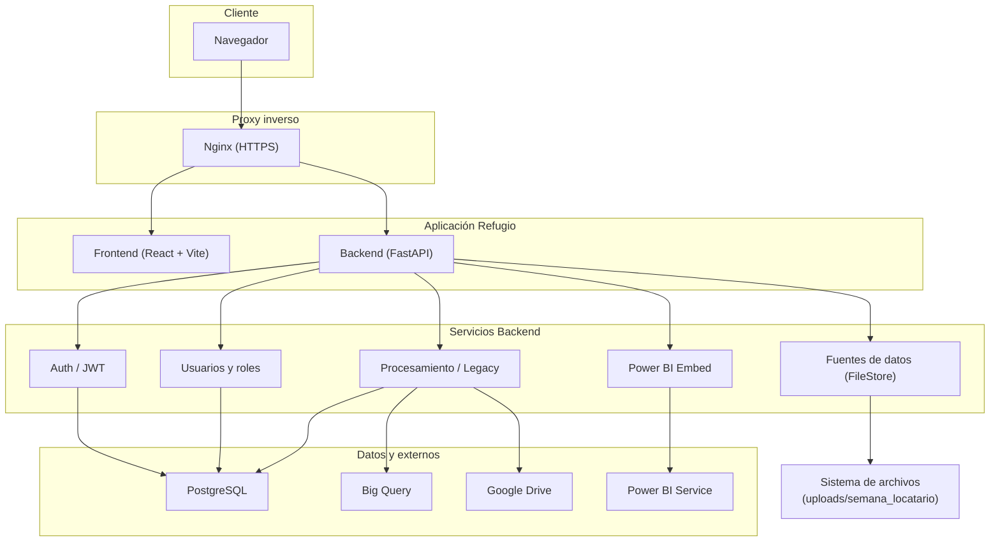

# Refugio Data – Sistema de Procesamiento y Carga a Big Query

Sistema web para procesamiento de datos de ventas, carga a Big Query, visualización en Power BI y gestión de fuentes de datos y usuarios. Incluye flujo legacy (Google Drive + hojas de configuración) y flujo moderno basado en **Fuentes de datos** (upload por semana y locatario).

---

## Contenido

- [Arquitectura](#-arquitectura)
- [Módulos y funcionalidad](#-módulos-y-funcionalidad)
- [Despliegue en VPS (Docker)](#-despliegue-en-vps-docker)
- [Comandos útiles](#-comandos-útiles)

---

## Arquitectura



### Flujo de datos resumido

| Origen | Destino | Uso |
|--------|---------|-----|
| Usuario | Nginx | HTTPS (frontend + API) |
| Frontend | Backend `/api/*` | Auth, fuentes, procesamiento, usuarios, Power BI |
| Backend | PostgreSQL | Usuarios, roles, permisos, estado del procesamiento |
| Backend | Big Query | Carga de ventas (stg_sales_raw, etc.) |
| Backend | Google Drive | Lectura de hojas de configuración y archivos (legacy) |
| Backend | Power BI Service | Token de embed (App Owns Data) |
| Fuentes de datos | `uploads/` | Archivos .xlsx/.csv por semana y locatario |

---

## Módulos y funcionalidad

### Frontend (React + Vite + TypeScript)

| Ruta / Área | Descripción |
|-------------|-------------|
| **Login** (`/login`) | Autenticación con usuario/contraseña; opción para **mostrar/ocultar contraseña**. |
| **Bienvenida** (`/bienvenida`) | Dashboard inicial con resumen y acceso al menú. |
| **Fuentes de datos** (`/fuentes`) | Página pública: selector de semana, locatario, **carga de archivos** (.xlsx/.csv) y listado por carpeta. |
| **Legacy** (`/legacy`) | Flujo manual legacy: Cierre de caja, configuración desde Drive, carga de ventas a Big Query. |
| **Power BI** (`/powerbi`) | Dashboard incrustado (embed) con token del backend. |
| **Gestión de usuarios** (`/users`) | CRUD de usuarios, roles y permisos (RBAC); modales para roles y permisos. |
| **Layout** | `MainLayout` con sidebar y header; rutas privadas con `PrivateRoute` y `AuthContext`. |

**Estilos:** Tipografía secundaria unificada con clase `text-refugio-muted` y variable `--color-refugio-muted` en `index.css` para mayor visibilidad en labels y texto de apoyo.

### Backend (FastAPI)

| Router (`/api`) | Descripción |
|-----------------|-------------|
| **`/auth`** | Login (JWT), registro interno; `get_current_user` para rutas protegidas. |
| **`/fuentes`** | FileStore: `semana-actual`, `archivos`, `upload` (por locatario), `delete` (protegido). |
| **`/procesamiento`** | Lógica legacy: cierre de caja, configuración, carga de ventas a Big Query. |
| **`/users`** (users_roles) | CRUD usuarios, roles, asignación roles/permisos. |
| **`/powerbi`** | Obtención de token de embed para Power BI (App Owns Data). |

Servicios principales: `file_store_service`, `legacy_service`, `ventas_service`, `bigquery_service`, `gdrive_service`, `powerbi`, `security` (JWT/hash).

### Infraestructura

- **Docker Compose:** `datarefugio_backend` (FastAPI), `datarefugio_frontend` (Nginx sirve build estático).
- **Red:** `app_shared_network` (externa) para conectar con Nginx proxy.
- **Volúmenes:** `./config` (credenciales GCP), `./uploads` (archivos subidos por Fuentes de datos).

---

## Despliegue en VPS (Docker)

Esta guía asume un VPS con Nginx como proxy inverso y la red Docker compartida `app_shared_network`.

### Requisitos previos

1. **Docker y Docker Compose** instalados.
2. **Nginx** configurado (ej. en `/home/projects/shared`).
3. **Red Docker:** `app_shared_network` creada.
4. **Google Drive:** Carpeta principal compartida con la Service Account (Editor).
5. **GCP:** `credentials.json` en `backend/config/credentials.json`.

### 1. Clonar y entrar al proyecto

```bash
cd /home/projects
git clone [URL_DEL_REPO] 001_procesamiento_refugio
cd 001_procesamiento_refugio
```

### 2. Variables de entorno

Crear `.env` en la raíz del proyecto.

> **Importante:** En producción se usan **IDs de Google Drive** (no rutas locales). Obtenerlos de la URL de la carpeta (ej. `https://drive.google.com/drive/folders/ID_AQUI`).

```env
# API
VITE_API_URL="https://api.datarefugio.gcbprojects.site/api"
API_URL="https://api.datarefugio.gcbprojects.site/api"

# App
PROJECT_NAME="Refugio - Sistema de Procesamiento"
VERSION="1.0.0"
API_STR="/api"

# Base de datos
POSTGRES_HOST=postgres
POSTGRES_PORT=5432
POSTGRES_DB=refugio_procesamiento_app
POSTGRES_USER=postgres
POSTGRES_PASSWORD=tu_password_seguro

# JWT
SECRET_KEY=tu_secret_key_seguro
ALGORITHM=HS256
ACCESS_TOKEN_EXPIRE_MINUTES=480

# Google Drive (IDs de carpeta/archivo)
DRIVE_ID_ARCHIVO_CONFIGURACION="..."
DRIVE_ID_CARPETA_CIERRECAJA="..."
DRIVE_ID_CARPETA_PROCESADOS="..."

# Big Query
BQ_PROJECT_ID=tu_proyecto
BQ_DATASET=Ventas
GOOGLE_APPLICATION_CREDENTIALS=./config/credentials.json

# Power BI (Azure Entra ID)
PBI_CLIENT_ID="..."
PBI_CLIENT_SECRET="..."
PBI_TENANT_ID="..."
PBI_WORKSPACE_ID="..."
PBI_REPORT_ID="..."
```

### 3. Nginx (proxy global)

En el `nginx.conf` del proxy (ej. `/home/projects/shared/nginx.conf`):

- Redirigir HTTP → HTTPS para `datarefugio.gcbprojects.site` y `api.datarefugio.gcbprojects.site`.
- Servidor HTTPS para **Frontend:** `proxy_pass http://datarefugio_frontend:80`.
- Servidor HTTPS para **Backend:** `proxy_pass http://datarefugio_backend:8080` con headers `Host`, `X-Real-IP`, `X-Forwarded-For`, `X-Forwarded-Proto`.

Reiniciar Nginx:

```bash
docker restart nginx_proxy
```

### 4. Levantar la aplicación

```bash
docker compose up -d --build
```

---

## Comandos útiles

| Comando | Descripción |
|---------|-------------|
| `docker compose up -d --build` | Construir y levantar en segundo plano. |
| `docker logs -f datarefugio_backend` | Ver logs del backend. |
| `docker logs -f datarefugio_frontend` | Ver logs del frontend. |
| `docker compose restart` | Reiniciar todos los servicios. |
| `git pull && docker compose up -d --build` | Actualizar código y reconstruir. |

### Certificados SSL (Certbot)

```bash
docker exec -it certbot certbot certonly --webroot -w /webroot \
  -d datarefugio.gcbprojects.site \
  -d api.datarefugio.gcbprojects.site \
  --email tu@email.com --agree-tos --no-eff-email
```

---

*Asegúrate de que los certificados SSL en Nginx apunten a los dominios correctos o uses un certificado wildcard.*
