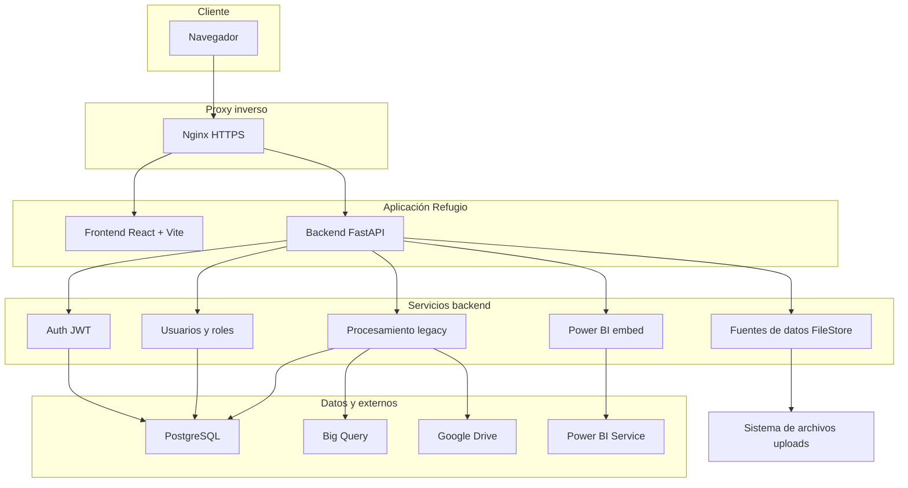

# Refugio Data – Procesamiento y carga a Big Query

Sistema web para procesamiento de ventas, carga a Big Query, visualización en Power BI y gestión de usuarios. Combina un flujo **legacy** (Google Drive y hojas de configuración) y un flujo **Fuentes de datos** (subida por semana y locatario vía `uploads/`).

---

## Contenido

1. [Estructura del repositorio](#estructura-del-repositorio)
2. [Arquitectura](#arquitectura)
3. [Módulos y funcionalidad](#módulos-y-funcionalidad)
4. [Variables de entorno](#variables-de-entorno)
5. [Despliegue en VPS (Docker)](#despliegue-en-vps-docker)
6. [Comandos útiles](#comandos-útiles)
7. [Aplicación móvil](#aplicación-móvil)

---

## Estructura del repositorio

| Directorio | Rol |
|------------|-----|
| `backend/` | API FastAPI (`/api/*`), servicios de archivo, legacy, Big Query, Power BI, auth. |
| `frontend/` | SPA React + Vite + TypeScript; build estático servido por Nginx en contenedor. |
| `config/` | Credenciales GCP y configuración sensible (no versionar secretos). |
| `uploads/` | Archivos subidos desde **Fuentes de datos** (organizados por semana/locatario). |
| `mobile/` | Monorepo Expo (Delivery: kiosk + runner); ver [mobile/README.md](mobile/README.md). |
| `docker-compose.yml` | Orquestación backend + frontend en red externa compartida con proxy. |

---

## Arquitectura

### Flujo de datos resumido

| Origen | Destino | Uso |
|--------|---------|-----|
| Usuario | Nginx | HTTPS: frontend estático + API |
| Frontend | Backend `/api/*` | Auth, fuentes, procesamiento, usuarios, Power BI |
| Backend | PostgreSQL | Usuarios, roles, permisos, estado de procesamiento |
| Backend | Big Query | Carga de ventas (p. ej. `stg_sales_raw`) |
| Backend | Google Drive | Configuración y archivos (legacy) |
| Backend | Power BI Service | Token embed (App Owns Data) |
| Fuentes de datos | `uploads/` | `.xlsx` / `.csv` por semana y locatario |

---

## Módulos y funcionalidad

### Frontend (React + Vite + TypeScript)

| Ruta | Descripción |
|------|-------------|
| `/login` | Autenticación; contraseña con opción mostrar/ocultar. |
| `/bienvenida` | Dashboard inicial y acceso al menú. |
| `/fuentes` | Selector semana/locatario, carga de archivos (`.xlsx`/`.csv`) y listado. |
| `/legacy` | Cierre de caja, configuración Drive, carga a Big Query. |
| `/powerbi` | Informe incrustado con token del backend. |
| `/users` | CRUD usuarios, roles y permisos (RBAC). |

Layout: `MainLayout` (sidebar + header); rutas privadas con `PrivateRoute` y `AuthContext`.

**Estilos:** clase `text-refugio-muted` y variable `--color-refugio-muted` en `index.css` para labels y texto de apoyo.

### Backend (FastAPI)

| Prefijo `/api` | Descripción |
|----------------|-------------|
| `/auth` | Login JWT, registro; `get_current_user` en rutas protegidas. |
| `/fuentes` | FileStore: semana actual, listado, upload por locatario, delete (protegido). |
| `/procesamiento` | Legacy: cierre de caja, configuración, carga de ventas a Big Query. |
| `/users` | Usuarios, roles, permisos. |
| `/powerbi` | Token de embed Power BI. |
| `/delivery` | API del módulo Delivery (apps en `mobile/`). |

Servicios destacados: `file_store_service`, `legacy_service`, `ventas_service`, `bigquery_service`, `gdrive_service`, `powerbi`, `security`.

### Infraestructura Docker

- **Contenedores:** `datarefugio_backend`, `datarefugio_frontend` (Nginx sirve el build).
- **Red:** `app_shared_network` (externa) para el proxy inverso del VPS.
- **Volúmenes:** `./config`, `./uploads`.

---

## Variables de entorno

- **Raíz del proyecto:** archivo `.env` usado por `docker-compose` para el backend (p. ej. `DATABASE_URL` vía `POSTGRES_*`, secretos JWT, Power BI, etc.). Mantener fuera del control de versiones.
- **Frontend en build Docker:** `VITE_API_URL` se pasa como `build arg` en `docker-compose.yml` (debe apuntar a la URL pública de la API, p. ej. `https://tu-dominio/api`).
- **Desarrollo local frontend:** variables `VITE_*` según `.env` del frontend.

---

## Despliegue en VPS (Docker)

1. Crear en el host la red Docker externa (una sola vez):  
   `docker network create app_shared_network`
2. Colocar credenciales en `./config` y completar `.env` en la raíz del proyecto.
3. Configurar Nginx (u otro proxy) con TLS hacia los contenedores en `app_shared_network`.
4. Ajustar en `docker-compose.yml` el argumento `VITE_API_URL` del servicio frontend para que coincida con la URL real de la API.
5. Desde la raíz del repo:  
   `docker compose build --no-cache && docker compose up -d`

**SSL:** los certificados del proxy deben cubrir los dominios del frontend y de la API (o un certificado wildcard acorde).

---

## Comandos útiles

| Acción | Comando (desde raíz del repo) |
|--------|-------------------------------|
| Levantar stack | `docker compose up -d` |
| Ver logs backend | `docker compose logs -f datarefugio_backend` |
| Ver logs frontend | `docker compose logs -f datarefugio_frontend` |
| Reconstruir tras cambios | `docker compose build && docker compose up -d` |

Desarrollo sin Docker: seguir README de `backend/` y `frontend/` (servidor API + `yarn dev` en frontend).

---

## Aplicación móvil

El directorio `mobile/` contiene apps Expo (Delivery: kiosk SUNMI y runner). No forma parte del flujo web de Big Query descrito arriba; comparte solo el repositorio. Detalle en [mobile/README.md](mobile/README.md).

---

*Documentación alineada con la arquitectura actual del sistema web Refugio Data.*
