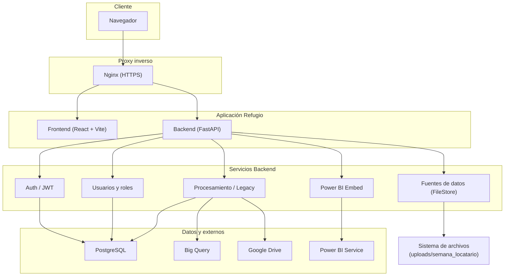

# Refugio Data – Sistema de Procesamiento y Carga a Big Query

Sistema web para procesamiento de datos de ventas, carga a Big Query, visualización en Power BI y gestión de fuentes de datos y usuarios. Incluye flujo legacy (Google Drive + hojas de configuración) y flujo moderno basado en **Fuentes de datos** (upload por semana y locatario).

---

## Contenido

- [Arquitectura](#-arquitectura)
- [Módulos y funcionalidad](#-módulos-y-funcionalidad)
- [Despliegue en VPS (Docker)](#-despliegue-en-vps-docker)
- [Comandos útiles](#-comandos-útiles)

---

## Arquitectura

### Flujo de datos resumido

| Origen | Destino | Uso |
|--------|---------|-----|
| Usuario | Nginx | HTTPS (frontend + API) |
| Frontend | Backend `/api/*` | Auth, fuentes, procesamiento, usuarios, Power BI |
| Backend | PostgreSQL | Usuarios, roles, permisos, estado del procesamiento |
| Backend | Big Query | Carga de ventas (stg_sales_raw, etc.) |
| Backend | Google Drive | Lectura de hojas de configuración y archivos (legacy) |
| Backend | Power BI Service | Token de embed (App Owns Data) |
| Fuentes de datos | `uploads/` | Archivos .xlsx/.csv por semana y locatario |

---

## Módulos y funcionalidad

### Frontend (React + Vite + TypeScript)

| Ruta / Área | Descripción |
|-------------|-------------|
| **Login** (`/login`) | Autenticación con usuario/contraseña; opción para **mostrar/ocultar contraseña**. |
| **Bienvenida** (`/bienvenida`) | Dashboard inicial con resumen y acceso al menú. |
| **Fuentes de datos** (`/fuentes`) | Página pública: selector de semana, locatario, **carga de archivos** (.xlsx/.csv) y listado por carpeta. |
| **Legacy** (`/legacy`) | Flujo manual legacy: Cierre de caja, configuración desde Drive, carga de ventas a Big Query. |
| **Power BI** (`/powerbi`) | Dashboard incrustado (embed) con token del backend. |
| **Gestión de usuarios** (`/users`) | CRUD de usuarios, roles y permisos (RBAC); modales para roles y permisos. |
| **Layout** | `MainLayout` con sidebar y header; rutas privadas con `PrivateRoute` y `AuthContext`. |

**Estilos:** Tipografía secundaria unificada con clase `text-refugio-muted` y variable `--color-refugio-muted` en `index.css` para mayor visibilidad en labels y texto de apoyo.

### Backend (FastAPI)

| Router (`/api`) | Descripción |
|-----------------|-------------|
| **`/auth`** | Login (JWT), registro interno; `get_current_user` para rutas protegidas. |
| **`/fuentes`** | FileStore: `semana-actual`, `archivos`, `upload` (por locatario), `delete` (protegido). |
| **`/procesamiento`** | Lógica legacy: cierre de caja, configuración, carga de ventas a Big Query. |
| **`/users`** (users_roles) | CRUD usuarios, roles, asignación roles/permisos. |
| **`/powerbi`** | Obtención de token de embed para Power BI (App Owns Data). |

Servicios principales: `file_store_service`, `legacy_service`, `ventas_service`, `bigquery_service`, `gdrive_service`, `powerbi`, `security` (JWT/hash).

### Infraestructura

- **Docker Compose:** `datarefugio_backend` (FastAPI), `datarefugio_frontend` (Nginx sirve build estático).
- **Red:** `app_shared_network` (externa) para conectar con Nginx proxy.
- **Volúmenes:** `./config` (credenciales GCP), `./uploads` (archivos subidos por Fuentes de datos).

---

*Asegúrate de que los certificados SSL en Nginx apunten a los dominios correctos o uses un certificado wildcard.*
