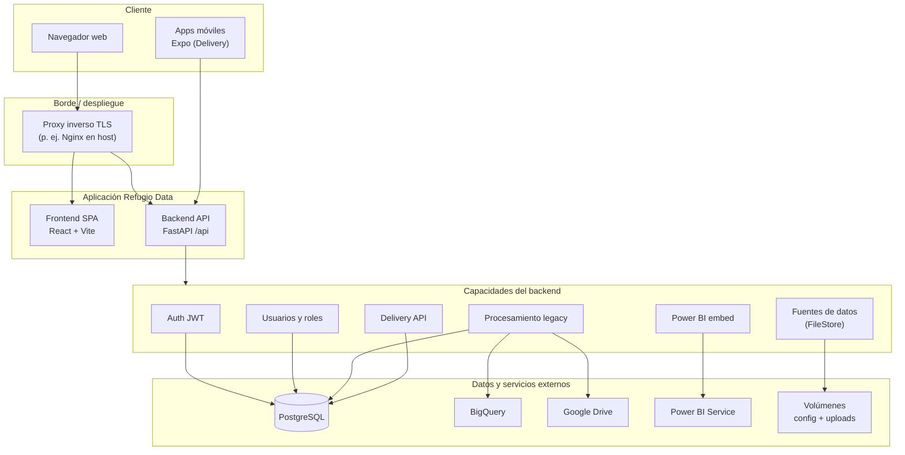

# Refugio Data — Procesamiento y carga a BigQuery

Plataforma corporativa para **procesamiento de ventas**, **gobernanza de datos** (usuarios y permisos), **integración analítica** (BigQuery, Power BI) y **operación de reparto** (apps móviles Delivery). Combina un flujo **legacy** (archivos y automatizaciones históricas) y un flujo **Fuentes de datos** (subida estructurada por periodo y locatario).

[](https://fastapi.tiangolo.com/)
[](https://react.dev/)
[](https://vitejs.dev/)
[](https://www.typescriptlang.org/)
[](https://www.postgresql.org/)
[](https://cloud.google.com/bigquery)
[](https://www.docker.com/)
[](https://expo.dev/)
[](https://tailwindcss.com/)

---

## Objetivo

- **Unificar** la ingesta y el procesamiento de información de ventas hacia un **almacén analítico** (BigQuery), manteniendo trazabilidad y control de acceso.
- **Exponer** una aplicación web segura (autenticación, roles) para operar cargas, revisar fuentes y consumir **informes embebidos** (Power BI).
- **Extender** la operación de campo con **apps móviles** (kiosk y runner) conectadas a la misma API, sin acoplar el flujo web de datos al ciclo móvil.

La documentación de este archivo describe el **repositorio y su arquitectura**. La configuración local y los secretos se gestionan **fuera del control de versiones**; consulta los `README` de `backend/`, `frontend/` y `mobile/` para el detalle operativo.

---

## Stack tecnológico

| Capa | Tecnologías |
|------|-------------|
| **API** | Python, FastAPI, Uvicorn, SQLAlchemy, Pydantic |
| **Web** | React 19, Vite 7, TypeScript, TanStack Query, Tailwind CSS |
| **Datos** | PostgreSQL, Google BigQuery, pandas / hojas de cálculo |
| **Integraciones** | Google APIs (p. ej. Drive), Microsoft Identity / Power BI (embed) |
| **Contenedores** | Docker, Docker Compose, Nginx (frontend estático en imagen) |
| **Móvil** | Expo, React Native, Yarn workspaces (monorepo) |

---

## Arquitectura

Vista lógica: cliente, proxy, aplicación y servicios externos.



### Flujo de datos (resumen)

| Origen | Destino | Rol |
|--------|---------|-----|
| Usuario web | Proxy + SPA + API | Operación y administración |
| Usuario móvil | API `/api/delivery` | Kiosk y runners |
| API | PostgreSQL | Identidad, permisos, estado operativo |
| API | BigQuery | Carga y preparación analítica de ventas |
| API | Sistema de archivos | Fuentes subidas y artefactos locales |
| API | Servicios en la nube | Drive, Power BI (según módulos habilitados) |

---

## Resultados

- **Pipeline de datos**: carga gobernada hacia BigQuery con apoyo en procesamiento en backend y validaciones de negocio.
- **Productividad operativa**: interfaz unificada para fuentes de datos, legado y paneles embebidos.
- **Seguridad y escalabilidad**: modelo RBAC sobre API REST; despliegue reproducible con contenedores.
- **Ecosistema ampliado**: módulo Delivery con apps dedicadas sin sobrecargar el flujo principal de analítica.

---

## Estructura del repositorio

| Directorio | Descripción |
|------------|-------------|
| `backend/` | API FastAPI: autenticación, fuentes, procesamiento, usuarios, Power BI, Delivery |
| `frontend/` | SPA React + Vite + TypeScript |
| `config/` | Material de configuración del despliegue (no versionar secretos) |
| `uploads/` | Archivos de **Fuentes de datos** (organización por periodo / locatario) |
| `mobile/` | Monorepo Expo: kiosk, runner y paquetes compartidos — [mobile/README.md](mobile/README.md) |
| `docker-compose.yml` | Orquestación backend + frontend (red externa típica en VPS) |

---

## Módulos y rutas web (referencia)

### Frontend

Rutas representativas: inicio de sesión, bienvenida, fuentes de datos, legado (cierre / configuración / BigQuery), Power BI, administración de usuarios. Navegación en layout principal con rutas privadas.

### Backend (`/api`)

Routers principales: autenticación, fuentes (FileStore), procesamiento legacy, usuarios y roles, Power BI, Delivery (consumo móvil).

---

## Comandos clave por módulo

Ejecuta los comandos desde la **raíz del repositorio** salvo que se indique otra carpeta.

### Infraestructura Docker (todo el stack web)

Red externa (una vez en el host, si aplica tu `docker-compose`):

```bash
docker network create app_shared_network
```

Construir y levantar servicios definidos en `docker-compose.yml`:

```bash
docker compose build --no-cache && docker compose up -d
```

Operación habitual:

```bash
docker compose up -d
docker compose logs -f datarefugio_backend
docker compose logs -f datarefugio_frontend
```

Tras cambios en código incluidos en la imagen:

```bash
docker compose build && docker compose up -d
```

El proxy TLS, nombres de host y enrutado hacia la red Docker se configuran en el **servidor**, no en este archivo.

---

### Backend (`backend/`)

```bash
cd backend
python -m venv .venv
# Windows: .venv\Scripts\activate
# Linux / macOS: source .venv/bin/activate
pip install -r requirements.txt
python main.py
```

La API expone estado en la raíz y la lógica de negocio bajo el prefijo `/api`. Puerto según tu entorno local (ver [backend/README.md](backend/README.md)).

---

### Frontend (`frontend/`)

```bash
cd frontend
yarn install
yarn dev
```

Build de producción:

```bash
yarn build
```

Para desarrollo, alinea la URL base de la API con tu instancia local según [frontend/README.md](frontend/README.md).

---

### Móvil (`mobile/`)

```bash
cd mobile
yarn install
yarn kiosk
# o
yarn runner
```

Iteración en navegador:

```bash
yarn kiosk:web
yarn runner:web
```

Detalle de apps y prerequisitos: [mobile/README.md](mobile/README.md).

---

## Documentación relacionada

- [backend/README.md](backend/README.md) — API y desarrollo local  
- [frontend/README.md](frontend/README.md) — SPA y build  
- [mobile/README.md](mobile/README.md) — Expo, workspaces y ejecución  

---

*README alineado con la arquitectura del sistema Refugio Data. Mantén credenciales y claves fuera del repositorio.*
