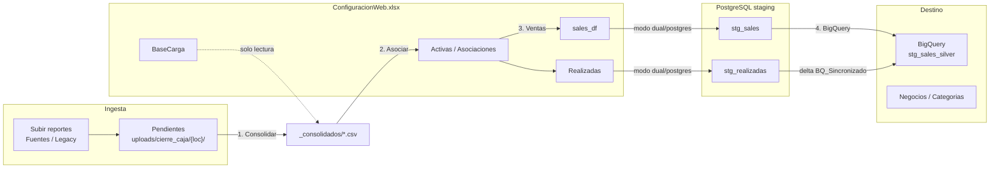

# PROCESAMIENTO — Flujo actual (legacy + FileStore)

Documentación operativa del pipeline de ventas: ingesta → consolidación → asociación → carga → BigQuery.

---

## Vista general



---

## Pasos del flujo (UI LegacyFlow)

| Paso | Acción | Entrada | Salida |
|------|--------|---------|--------|
| 0 | Subir reportes | XLSX/CSV del POS | `uploads/cierre_caja/{locatario}/` (pendientes) |
| 1 | **Consolidar** | Pendientes + BaseCarga | CSV en `_consolidados/` por locatario y rango |
| 2 | **Asociar** | Consolidados + catálogo negocios | Filas en hoja **Activas** (ConfiguracionWeb) |
| 3 | **Ventas** | Activas con `Cargar=1` | **sales_df** + **Realizadas**; limpia Activas; archiva a procesados |
| 4 | **BigQuery** | Ventas + Realizadas pendientes | MERGE en `stg_sales_silver`; TRUNCATE Negocios/Categorias |

Tras el paso 3, los archivos procesados del FileStore pasan a la zona **procesados** del locatario.

---

## Dónde vive cada dato

| Artefacto | Rol | Excel | PostgreSQL | BigQuery |
|-----------|-----|-------|------------|----------|
| BaseCarga | Coordenadas de extracción por negocio | Sí | — | — |
| Activas | Cola temporal de asociaciones | Sí | — | — |
| sales_df | Ventas normalizadas (silver local) | excel/dual | dual/postgres (`stg_sales`) | — |
| Realizadas | Auditoría de cargas + delta BQ | excel/dual | dual/postgres (`stg_realizadas`) | — |
| Negocios / Categorias | Referencia | Sí (lectura) | — | TRUNCATE + carga |
| Ventas analíticas | Capa silver | — | — | `stg_sales_silver` (MERGE) |

---

## Modos de staging (`SALES_STAGING_MODE`)

| Modo | sales_df | Realizadas | BQ / preview leen de |
|------|----------|------------|----------------------|
| `excel` (default histórico) | Solo Excel | Solo Excel | Excel |
| `dual` (recomendado migración) | Excel + PG | Excel + PG | PostgreSQL si hay filas |
| `postgres` | Solo PG | Solo PG | PostgreSQL |

`REALIZADAS_STAGING_MODE` es opcional; si no está definido, hereda `SALES_STAGING_MODE`.

Variables en `config/.env`:

```env
SALES_STAGING_MODE=dual
# REALIZADAS_STAGING_MODE=dual
```

---

## Paso 1 — Consolidar

- Lee pendientes por locatario desde FileStore.
- Extrae ventas con **BaseCarga** (coordenadas Excel) o **fallback** por detección de encabezado.
- Filtra por rango de fechas (`semana_actual`, `ultima_semana`, `rango_libre`).
- **Deduplicación** con clave alineada a BigQuery cuando es posible:
  `CodigoNegocio + FechaHora + CodigoTransaccion + Monto`.
- Montos anómalos (> 50 000) van a **cuarentena** (no se fuerzan a 0).
- Parámetro `dry_run=true`: informe sin escribir CSV.

---

## Paso 2 — Asociar

- Vincula cada consolidado con un negocio (fuzzy matching sobre nombres/rutas).
- Escribe en **Activas** (`RutaArchivo`, `CodigoNegocio`, `FechaInicio`, `FechaFin`, `Cargar`).

---

## Paso 3 — Ventas

- Procesa filas de Activas con `Cargar=1`.
- Rutas `.../_consolidados/...` se leen como CSV ya normalizado; el resto usa BaseCarga.
- Archivos no encontrados: **omitidos con warning** (sin registros sintéticos).
- Append en sales_df / upsert en `stg_sales`.
- Append en Realizadas / upsert en `stg_realizadas` (`BQ_Sincronizado=0`).
- **Una fila por negocio y periodo:** clave `CodigoNegocio + FechaInicio + FechaFin`. Varias rutas del mismo negocio se fusionan en `RutaArchivo` (separadas por ` | `); `Ventas Totales` conserva el máximo del grupo (re-ejecuciones del mismo periodo).
- Opción `clear=true`: vacía sales_df, Realizadas y tablas PG de staging.

---

## Paso 4 — BigQuery

- **`modo_sync=pendiente`** (default): MERGE solo ventas asociadas a Realizadas con `BQ_Sincronizado=0`; luego marca sincronizadas.
- **`modo_sync=completo`**: MERGE de todo el staging de ventas (recuperación / migración).
- MERGE idempotente por clave natural: `CodigoNegocio`, `FechaHora`, `CodigoTransaccion`, `Monto`.
- Tabla destino: `BQ_TABLE_SALES` (habitual `stg_sales_silver`).

---

## API (`/api/procesamiento/legacy/...`)

| Método | Ruta | Descripción |
|--------|------|-------------|
| POST | `/consolidar` | Consolidar pendientes (`dry_run`, `modo_rango`) |
| POST | `/asociar` | Asociar consolidados |
| POST | `/cargar-ventas` | Paso ventas (`clear`, `archivar_pendientes_tras_consolidado`) |
| POST | `/cargar-bigquery` | Sync BQ (`modo_sync=pendiente\|completo`) |
| GET | `/staging-status` | Estado Excel vs PostgreSQL |
| POST | `/import-staging-excel` | Migrar sales_df → `stg_sales` |
| POST | `/import-realizadas-staging-excel` | Migrar Realizadas → `stg_realizadas` |
| GET | `/preview-sales` | Vista previa sales (paginada, `monto_total`) |
| GET | `/preview-realizadas` | Vista previa Realizadas |

---

## UI (LegacyFlow)

- Badge **Staging** con modo, fuente activa y conteos Excel/PG.
- Botones de importación histórica (superuser): `sales → PG`, `realizadas → PG`.
- Modal de consolidación muestra duplicados eliminados y claves usadas.
- Vista previa indica fuente (`Excel` / `PostgreSQL`) y modo.

---

## Archivos clave del código

| Área | Ruta |
|------|------|
| Orquestación | `backend/app/services/legacy_service.py` |
| Sync BQ | `backend/app/services/bq_sales_sync.py` |
| Normalización montos | `backend/app/services/ventas_normalizacion.py` |
| Deduplicación | `backend/app/services/ventas_deduplicacion.py` |
| Staging ventas | `backend/app/services/sales_staging_service.py` |
| Staging realizadas | `backend/app/services/realizadas_staging_service.py` |
| Constantes | `backend/app/core/data_constants.py` |
| API | `backend/app/api/procesamiento.py` |
| Frontend | `frontend/src/pages/flowprocess/LegacyFlow.tsx` |

---

Ver también: [PROCESAMIENTO_CAMBIOS_REFACTOR.md](./PROCESAMIENTO_CAMBIOS_REFACTOR.md), [PROCESAMIENTO_OPERACION.md](./PROCESAMIENTO_OPERACION.md).
